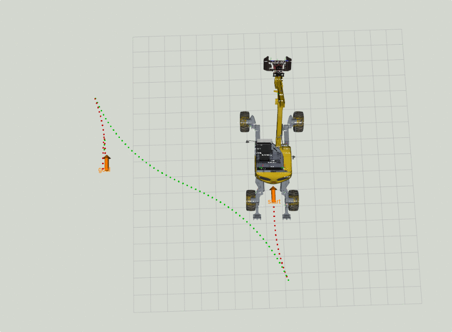

# Planning and control for car-like vehicles

## Overview

Pure pursuit controller and Reeds-Shepp sampling based planner for navigation in SE(2) space. This package has been mainly intended for car-like vehicles, although it can be used with mobile bases too.

How is this package different from other SE(2) planning/control packages? 

* Provides planning and control for car like vehicles which are non-holonomic
* Correctly handles both forward and reverse driving
* Allows joint path and approach pose planning when we only know approximate target location
* Comes with a minimal set of dependencies
* Core algorithmics is separated from ros dependent code
* Tested on real-hardware
* Comes with a car example
* Integrated with [grid_map](https://github.com/ANYbotics/grid_map) package
* Features visualizatios and rviz planning interface
* Easily extensible
* Supports dynamic reconfigure for controller tuning

**Warning:** At the moment, this planning and control framework uses geometric planners which makes it unsuitable for high-speed driving. It is meant to be used for slow maneuvers, e.g. parking maneuvers. 

Released under [BSD 3-Clause license](LICENSE).

**Author:** Edo Jelavic

**Maintainer:** Edo Jelavic, [jelavice@ethz.ch](jelavice@ethz.ch)

| Navigation with prius        | Navigation with Menzi Muck M545 |
|:----------------------:|:-----------------:| 
|   |  |  

| Navigation with Spacebok |
|:----------------------:|
||

## Publications
The code inside this repo has been developed as a part of our research on autonomous precision harvesting. The paper can be found [here](https://arxiv.org/abs/2104.10110). If you are using packages from se2_navigation, please add the following citation to your publication:

Jelavic, E., Jud, D., Egli, P. and Hutter, M., 2021. Towards Autonomous Robotic Precision Harvesting. arXiv preprint arXiv:2104.10110.
 
    @article{jelavic2021towards,  
       title   = {Towards Autonomous Robotic Precision Harvesting},  
       author  = {Jelavic, Edo and Jud, Dominic and Egli, Pascal and Hutter, Marco},  
       journal = {arXiv preprint arXiv:2104.10110},  
       year    = {2021}
    }
   

## Documentation

This package is split into smaller units each of which features it's own README. Follow   these links for more info:

* [car_demo](car_demo/README.md)
* [pure_pursuit_core](pure_pursuit_core/README.md)
* [pure_pursuit_ros](pure_pursuit_ros/README.md)
* [se2_navigation_msgs](se2_navigation_msgs/README.md)
* [se2_planning](se2_planning/README.md)
* [se2_planning_ros](se2_planning_ros/README.md)
* [se2_planning_rviz](se2_planning_rviz/README.md)
* [se2_visualization_ros](se2_visualization_ros/README.md)
* [approch_pose_planner](se2_approach_pose_planning/approach_pose_planner/README.md)
* [approach_pose_planner_ros](se2_approach_pose_planning/approach_pose_planner_ros/README.md)

## Installation
Refer to [car_demo](car_demo/README.md) for the details.
Refer to [approach_pose_planner](se2_approach_pose_planning/approach_pose_planner_ros/README.md) if you are interested in approach pose planning.

## Usage
Run the main demo with:   
`roslaunch car_demo demo_autonomous.launch`   
See [car_demo](car_demo/README.md) for the details.

## Coming soon
* Mobile base demo
