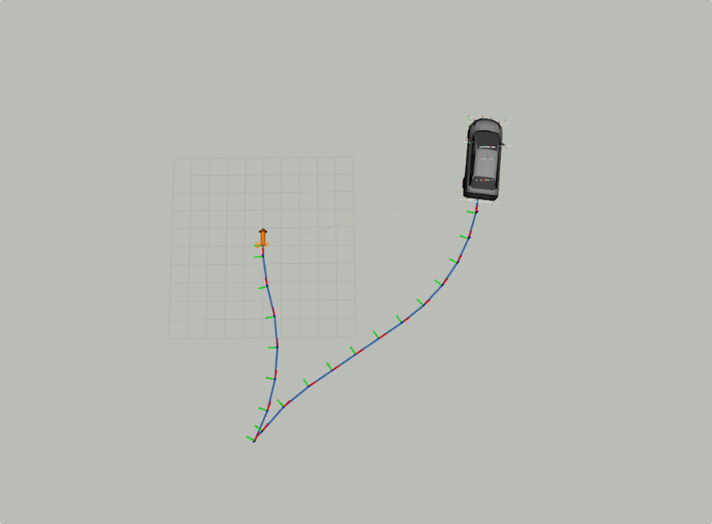

# Car demo

This is a minimal version of Prius car from Open Source Robotics Foundation (Demo of Prius in ROS/GAZEBO). The original code is available available at: https://github.com/osrf/car_demo . This slightly modified version, can be run with `se2_navigation` planning and control pipeline. 

This demo has been tested on Ubuntu Focal Fossa (20.04). 

## Dependencies
To build `car_demo` package you need to build the whole `se2_navigation` stack. You will need the full ros noetic install with Gazebo 11 to run this demo. The instructions to do so, you can find here: http://wiki.ros.org/noetic/Installation 

1. Make sure that you have installed [OMPL](https://github.com/ompl/ompl). You can find some instructions [here](../se2_planning/README.md)
2. Install `yaml-cpp` library. [Instructions](../pure_pursuit_ros/README.md)
3. Install `fake_localization` package with `sudo apt install ros-noetic-fake-localization`

Assuming that the ros has installed correctly this should be enough to get you started. In case you cannot build the package refer to individual package README.

## Installation
Build with `catkin build car_demo`   

## Autonomous Mode
1. Launch with:
`roslaunch car_demo demo_autonomous.launch`   

2. The rviz planning panel should pop up. 
3. Make sure that the `Start==curent position` checkbox is checked

You can drag the goal marker to set goal positions. Starting position is determined automatically from the simulation (it is current position of the car). 

1. Press `Request Plan` to trigger planning
2. Press `Start Tracking` to start tracking the plan
3. Press `Stop Tracking` to stop tracking the plan

## Manual Mode
Launch with:  
`roslaunch car_demo demo_joystick.launch`   

If using a Logitech F710 controller:

* Make sure the MODE status light is off
* Set the swtich to XInput mode
* The right stick controls throttle and brake
* The left stick controls steering
* Y puts the car into DRIVE
* A puts the car into REVERSE
* B puts the car into NEUTRAL
