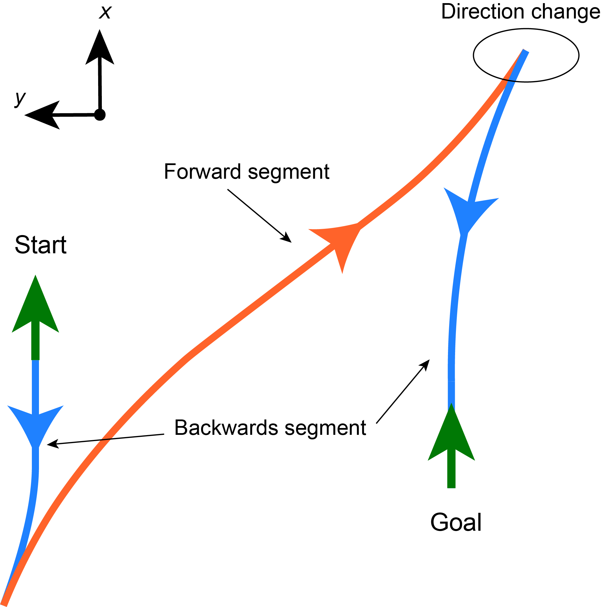
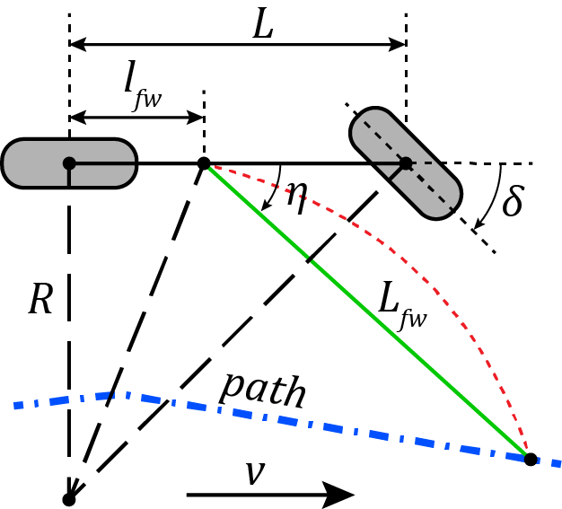
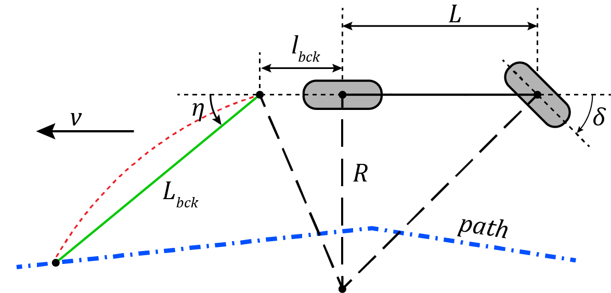

# pure\_pursuit_core

## Conventions

### Path

Paths are divided into segments. A segment is a part of the path where the driving direction does not change. In the Figure below, the path has three segments. Each segment is piecewise linear and it is defined with a set of points. A minimum of two points is required.

### Pure pursuit controller
Pure pursuit controller is based on the following work:  
`Kuwata, Yoshiaki, et al. "Motion planning in complex environments using closed-loop prediction." AIAA Guidance, Navigation and Control Conference and Exhibit. 2008.`
Figures below show the conventions used and are taken from the article with minor modifications. Controller is split into a heding controller which controls the orientations of the vehicle and the longitudinal velocity controller which controls the forward speed of the vehicle.

| Forward driving        | Backwards driving |
|:----------------------:|:-----------------:| 
|     |   |

### Symbols and parameters

#### Heading Controller
* δ - steeering angle
* η - lookahead angle
* lfw - anchor distance for forward driving (configurable)
* Lfw - lookahead distance for forward driving (configurable)
* L - length of the wheel base (configurable)
* lbck - anchor distance for backwards driving (configurable)
* Lbck - lookahead distance for backwards driving (configurable)  

In addtiion, the controller also has build in dead zone, rate limiter and and an average filter than can be used to filter the output steering angle.

## Installation
Build with:   
`catkin build pure_pursuit_core`   

Run the tests with:   
`catkin build pure_pursuit_core --no-deps --verbose --catkin-make-args run_tests`

## Usage

The code is meant to be used as a part of a bigger project. Please refer to [car_demo](../car_demo) for some examples.

## Dependencies
Other than Eigen, this package has no other dependencies.

## Adding  your own controllers
todo
