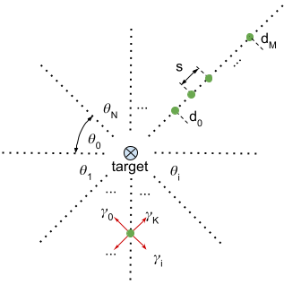
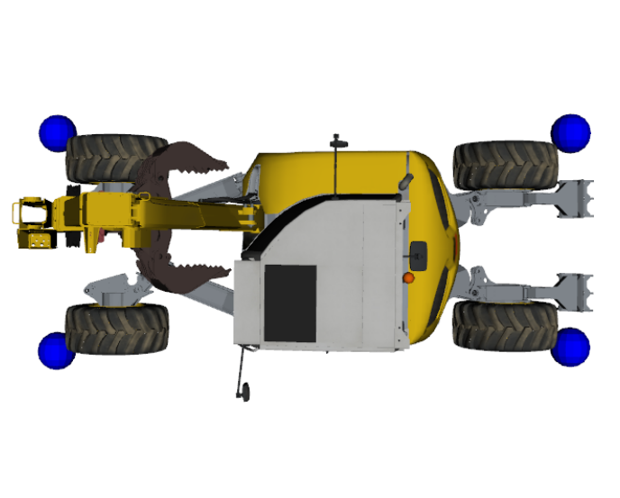
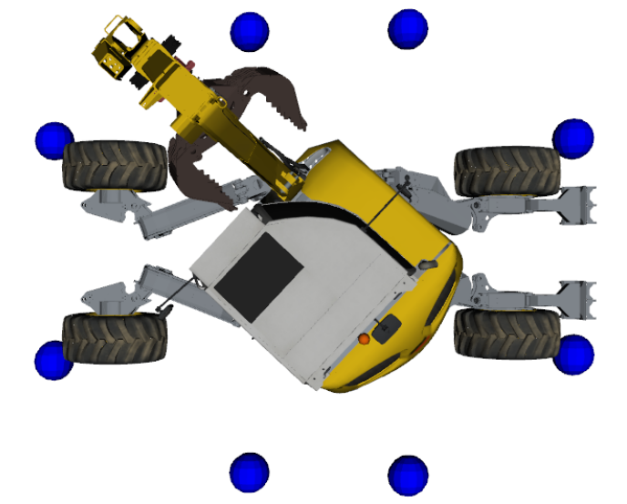
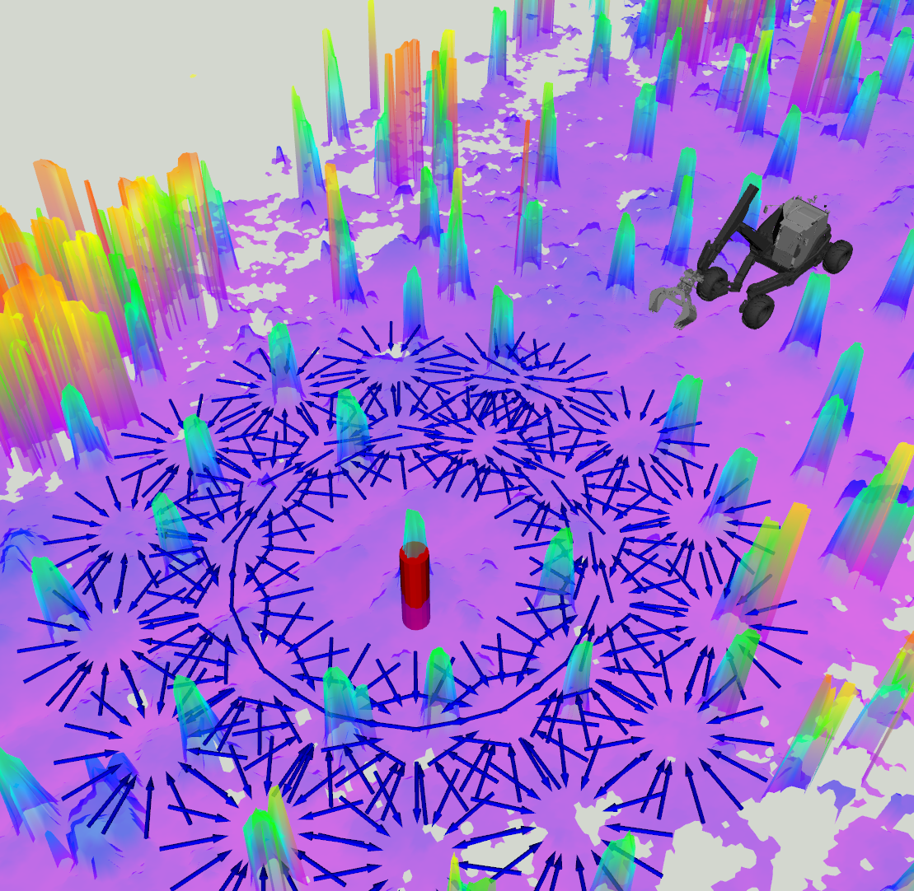
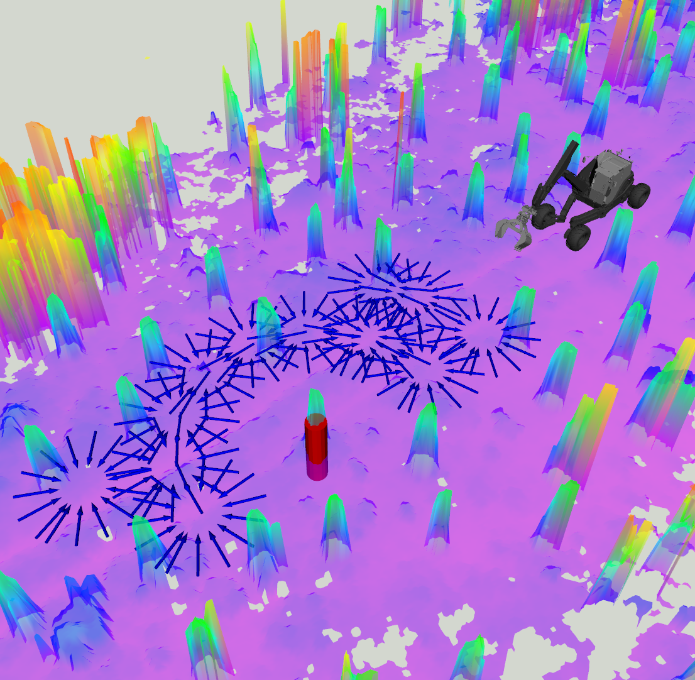
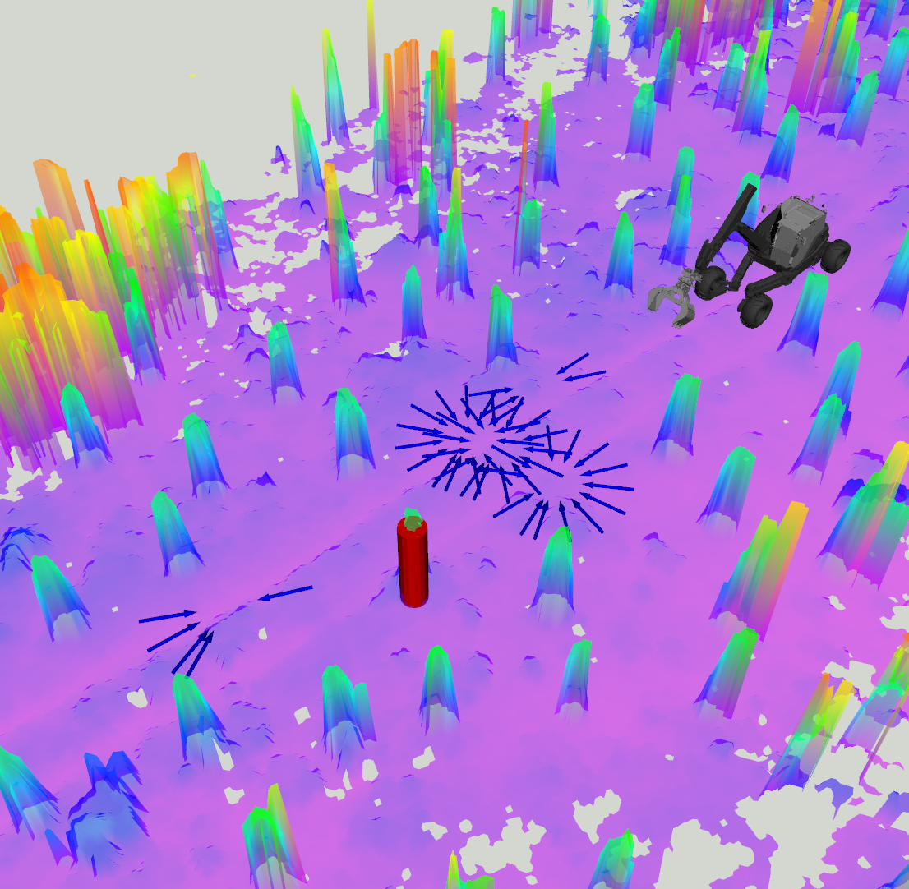

# approach\_pose\_planner

This package provides an approach pose planner that jointly plans an approach pose and a path. The use case is motivated by an autonomous tree harvesting mission where we know the tree locations (x,y) however it us unclear from which direction should we approach them in the unstructured environment. The tree location is merely an approaximate location for the endeffector of the tree harvester.

Below you will find a short summary of the algorithmics, for more detailed explanation, please refer to the following [paper](https://arxiv.org/abs/2104.10110).

## Algorithm

The planner is solves two subproblems. First we generate feasible approach poses (neccesary criterion, not sufficient) and then we try to grow a random tree to connect to each of them. The first step ensures that candidate approach poses are collision free while the second step finds the ones that can actually be driven to.

### Approach pose generation

The algorithm generates M * N * K approach poses by cominging M distances from the target, with N polar angles to generate positions around the target. Lastly the M * N positions are combined with K yaw angles to generate M * N * K approach poses. The distances increaase with step _s_ where d0 is the minimal distance and dM maximal distance. The polar angles are denoted with theta and yaw angles with gamma. Red arrows denote approach poses with orientations gamma.

)

### Feasibility checking
Each approach pose is checked for collisions with the environment. Note that the collision footprint for approach pose collision checking can in general be different than the one for driving (typically a rectangle). Hence we can use the smaller footprint for driving and larger one for approach pose generation. Using a larger footprint is useful if we have a mobile manipulator that needs to swing the arm. See image below:

 

In addition to collision checking, we introduce a reachability criterion to test whether we can reach the target from the candidate approach pose. This can be useful for mobile manipulators that need to grab the target from the planned approach pose. Reachability footprint always extends from the base frame to the target in a straight line as shown below. Reachability footprint's width can be specified as a parameter, as well as length of the red portion of the rectangle. Obstacles inside the red are ignored for reachability checking.

### Approach pose generation example

Below is an example that illustrates the feasibility checking procedure. On the left are all the approach poses generated, middle are the ones where the reachability criterion is satisfied and on the right there is both no collision and the reachability criterion is satisfied.

One can easily implement their custom feasiblity checker by deriving from the appropriate interfaces.

## Dependencies

approach_pose_planner depends on following packages:

- [OMPL](https://github.com/ompl/ompl)
- se2_planning

## Installation

Follow the installation guidelines for the [se2_planning](../se2_planning/README.md) package. Once you can build the se2_planning, simply build approach_pose_planner with:

`catkin build approach_pose_planner`  

## Usage
This package provides the algorithm implementation. For ros integration see [approach_pose_planner_ros](../approach_pose_planner_ros/README.md) package.

## Parameters

The approach pose planner reuses some of the algorithms inside the se2_planning package and hece shares some of the parameters

### State Space
See se2_planning.

### Planner
See se2_planning.

* obstacle_layer - grid map layer that contains the layer with obstacles. Obstacle layer is used for collision checking.

### Height Map
* height_layer - Name of the height map layer in the grid map.
* topic - grid map topic in case you a publishing it or loading from a ros bag.

### Robot footprint
* See sketch [here](../../se2_planning/README.md).

### Line of Sight Validator
* is_assume_target_always_reachable - bool flag whether to perform reachability checking as described above.
* collision_checking_area_width - width of the rectangle that is constructed to check the reachability criterion.
* line_of_sight_length_allowed_to_be_in_collision - length of the area that is allowed to be in collision with the target (red portion of the rectangle in the image).

### Approach Pose Planner

*  polar_angle_spacing_around_goal - increments of polar angle around the goal, e.g. 10 deg will result in 36 polar angles
*  candiate_pose_yaw_spacing - increments in yaw angle for generated approach positions, e.g. 20 deg will create 13 different orientations for each position given
*  min_goal_distance - min distance to the target
*  max_goal_distance - maximal distance to the target
*  distance_step - increment between minimal and maximal distance

