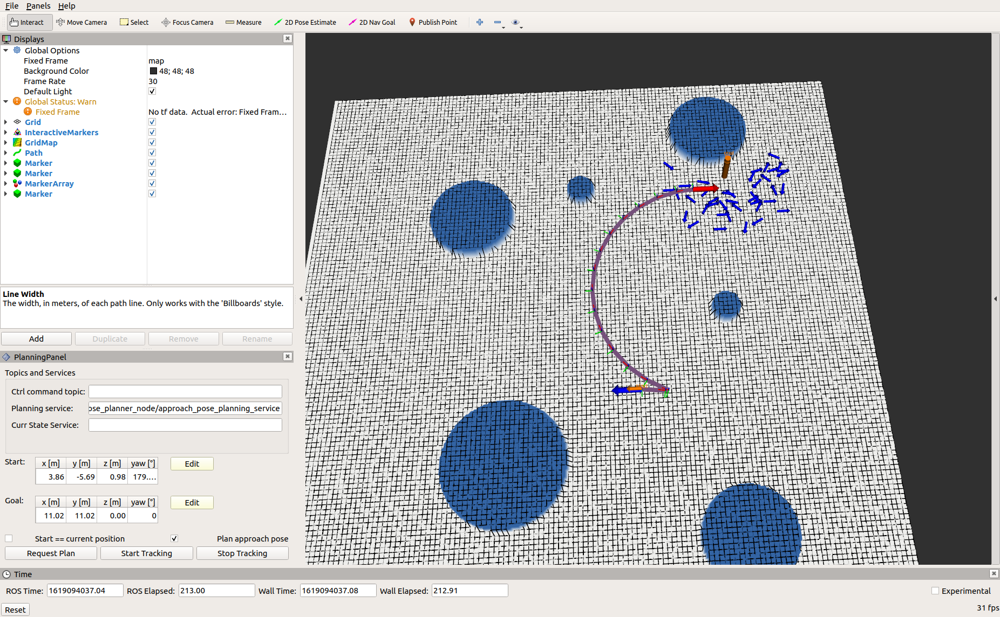

# approach\_pose\_planner\_ros

This package provides ros integration for the approach_pose_planner.

## Dependencies

approach_pose_planner depends on following packages:

- [OMPL](https://github.com/ompl/ompl)
- se2_planning_ros
- yaml-cpp
- approach_pose_planner
- approach_pose_planner_msgs
- se2_visualization_ros
- grid_map_ros

## Installation

Build with

`catkin build approach_pose_planner_ros`

if you can succesfully build the approach_pose_planner package, the ros integration should be easy to build.  

## Usage

If you would like to try the planner on an example map, make sure that you compile the [se2_grid_map_generator](../../se2_grid_map_generator/README.md) package with:  

`catkin build se2_grid_map_generator`

 You can create an example map with:  
`roslaunch approach_pose_planner_ros generate_grid_map.launch`  

If you did not modify the python node, the map will be saved to the default location (see [se2_grid_map_generator](../../se2_grid_map_generator/README.md)). In case you don't generate the map, the planner just assumes that everyhing is free space. Now you can run the approach pose planner node with:   

`roslaunch approach_pose_planner_ros approach_pose_planner_ros.launch`

This should open up a planning panel as in image below. For instructions on how to add the planning panel, refer to [se2_planning_rviz](../../se2_planning_rviz/README.md). In case the map is not shown correctly make sure that you have compiled the grid map rviz plugin (in case you are compiling from source).

To use the approach pose planner, you have to have *Plan approach pose* box checked. The goal target is shown with an orange cylinder and there is an orange sphere howering above the target point. The path is shown with a purple color and blue arrows show a subset of candidate approach poses. Thick red and blue arrows are the final approach pose and the starting pose, respectively.

Note that when planning an approach pose the yaw nagle given in the goal pose is ignored.

## Parameters

The approach pose planner reuses some of the algorithms inside the se2_planning package and hece shares some of the parameters

### Approach pose planner ros
Some parameters are shared with se2_planning_ros package, please refer to the respective [README](../../se2_planning_ros/README.md)

*  approach_poses_visualization_decimation_factor - decimation factor for the set of candidate approach poses. E.g. if 100, only every 100th candidate approach pose will be published.
*  pose_arrow_radius - parameter for the pose visualization marker
*  pose_arrow_length - parameter for the pose visualization marker
*  target_location_sphere_radius - radius of the sphere marker that denotes the target positions

