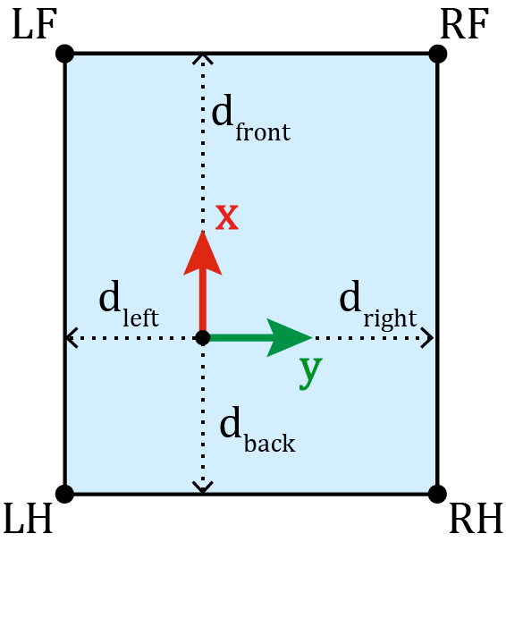

# se2_planning
This package provides core algorithmics for planning is SE(2) space. Current implementation is based on Ompl and RRT*, however one could also add a custom planner.

Coming soon:
* more state spaces including hybrid Reeds-Shepp curves
* planning for holonomic robots such as mobile bases
* integration of more ompl planners

## Conventions

### Collision checking
Rectangular collision footprint is shown in an image below. We allow for arbitrary polygons to be used as a collision footprint, as long as the vertices are ordered counter-clockwise. Rectangular fooprints can be created using conveniece functions provided. The footprint is defined by four points:   

* Right Hind (RH)
* Right Front (RF)
* Left Front (LF)
* Left Hind (LH)

User can either specify those point manually, of define 4 measures shown in the image below. The points will then be calculated automatically. All distances are marked with `d` and measured from the origin of the coordinate system.

## Dependencies

se2_planning depends on following packages:

- [OMPL](https://github.com/ompl/ompl)
- [grid_map_core](https://github.com/ANYbotics/grid_map)
- Boost
- Eigen

## Installation

Eigen and Boost are shipped with the Ubuntu distribution. You can install OMPL from source if you want to use the planner without ROS integration. The easiest wayto build ompl is to build it using catkin build system:

Inside your catkin workspace source folder (src) do:  

`git clone git@github.com:ompl/ompl.git`
`git clone git@github.com:ANYbotics/grid_map.git`    
`catkin build ompl grid_map_core` 

Ompl can be also build using pure CMake, plese refer to https://ompl.kavrakilab.org/.

In case this does not work for you refere to the OMPL [website](https://github.com/ompl/ompl/blob/master/doc/markdown/installation.md) for installation instructions. If you're using the ROS interface, installation can also be done through PPA.

`sudo apt install ros-noetic-ompl ros-noetic-grid-map-core`

Build with:

`catkin build se2_planning`  

To build in release mode:  

`catkin build --cmake-args -DCMAKE_BUILD_TYPE=Release`  

Building in release mode affects the perfromance a lot (code runs about order of magnitude faster).  

To run tests, use:
`catkin build se2_planning --no-deps --verbose --catkin-make-args run_tests`

## Usage
This is merely core algorithmics, meant to be used inside another package.

## Parameters

### State Space
Currently only Reeds-Shepp state space is supported.
* upper bound in x dimension
* lower bound in x dimension
* upper bound in y dimension
* lower bound in y dimension (all in meters)
* turning radius of a vehicle (in meters)

### Planner
* path spatial resolution - distance between points on a path (path is piecewise linear), smaller number means more points.
* planner range - maximal range used when extending the tree inside RRT* (see [ompl docs](https://ompl.kavrakilab.org/classompl_1_1geometric_1_1RRTstar.html#gRRTstar))
* max planning time - maximal time the planner will spend finding or trying to improve the path
