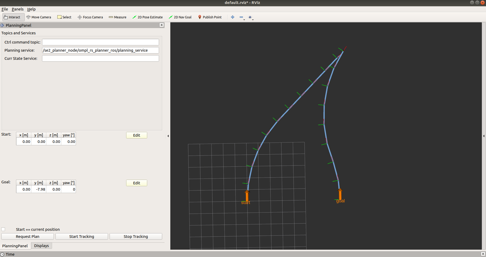

# se2_planning_ros

Integration of se2_plnning with ros. Ros planner advertises a `planning_service_name` service which is defined in [`se2_navigation_msgs`](../se2_navigation_msgs); name of the service itself is a parameter specified in the .yaml [file](/config/reeds_shepp_planner_ros_example.yaml). In case of sucessfull planning, the path will be published on the `path_msgs_topic`. In addition the planner will publish plan on another topic `nav_msgs_path_topic` which is used for visualization.

## Dependencies

* eigen
* nav_msgs
* roscpp
* se2_navigation_msgs (in this repo)
* se2_planning (in this repo)
* se2_planning_rviz (in this repo)
* tf2
* yaml-cpp

## Installation

First install and build `se2_planning` package, see the instructions [here](../se2_planning/README.md).

Build with:

`catkin build se2_planning_ros`  

## Usage
Run with:
`roslaunch se2_planning_ros se2_planner.launch`

The easiset way to use the planner is to use the planning interface for rviz shown below:

You can drag the interactive markers to change the start and goal position. The marker is enabled when you click on the `Edit` button. Click `Finish` button to finish editing and save current pose. Leave the  `Start==current position` box unchecked. To use the rviz interface you will have to build the [se2_planning_rviz](../se2_planning_rviz) package.

Should you not want to use rviz interface, you can also call the planning service directly from the terminal. An example call that will compute a plan moving the robot 2 meters forward is given with:   
`rosservice call /se2_planner_node/ompl_rs_planner_ros/planning_service "pathRequest:
  startingPose:
    position: 
      x: 0.0
      y: 0.0
      z: 0.0
    orientation:
      x: 0.0
      y: 0.0
      z: 0.0
      w: 0.0
  goalPose:
    position:
      x: 2.0
      y: 0.0
      z: 0.0
    orientation:
      x: 0.0
      y: 0.0
      z: 0.0
      w: 0.0" 
`

## Parameters

### Planner ros
This planner extendes the one inside the `se2_planning` package. The parametes are topics to be advertised by the planner.

* `nav_msgs_path_topic` - topic where nav_msgs::Path message is published. Used merely for visualization with Rviz.
* `planning_service_name` - name of the planning service
* `path_msg_topic` - topic where the path will be published (used by the controllers)
* `path_frame` - frame id of the path
* `nav_msg_path_spatial_resolution` - spatial resolution of nav_msgs::Path in meters (euclidean distance between two points in the path)
