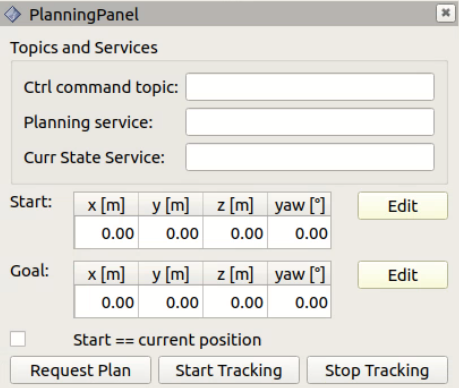

# se2_planning_rviz
This package builds an rviz plugin that can be used to give high-level goal pose commands to the planner.

## Dependencies

* geometry_msgs 
* roscpp
* se2_visualization_ros (in this repo)
* se2_navigation_msgs (in this repo)
* tf2
* visualization_msgs

This pakcage also depends on [Qt](https://www.qt.io/) version 5.

## Installation
Make sure that you have installed Qt on your machine.
Build with:
`catkin build se2_planning_rviz`   
Make sure that the package is built and that your workspace has been sourced.

You can add the plugin in a following way:  
1. Open Rviz
2. Click on `Panels` -> `Add New Panel`
3. From the panel type menu, under tab `se2_planning_rviz`, select `PlanningPanel`
4. The panel should appear on the left of the rviz window.

## Usage
The planning panel is shown below:

* `Ctrl command topic` - enter the name of the service to send commands to the controller (advertised by the controller)
* `Planning service` - enter the name of the service to send planning request (advertised by the planner)
* `Curr State Service` - enter the name of the service to get current state form the controller (advertised by the controller)

All services and messages are defined in [se2_navigation_msgs](../se2_navigation_msgs) package. Topic names and service names are defined in the corresponging packages.

* `Request Plan Button` - call planning service advertised by the planner
* `Start Tracking Button` - send start tracking command to the controller (calls `controller command` service)
* `Stop Tracking Button` - send stop tracking command to the controller (calls `controller command` service)
* `Start == current position` - if enabled, the GUI will call `get current pose` service advetised by the controller to get the current pose of the robot. This will be used as a starting pose for the planner. Starting pose in the GUI will be ignored.
* `Plan approach pose` - if checked the planning panel tries to call the approach pose planning service. This means that you should have the approach pose planner running in another node. Furthermore you need to specify the correct service name in the *Planning service* field. When you are trying to plan an approach pose to some target only (x,y) position are extracted from the goal marker. The yaw angle is ignored. The marker changes from the arrow to a cylinder, to indicate that only (x,y) position is sent to the approach pose planner.
